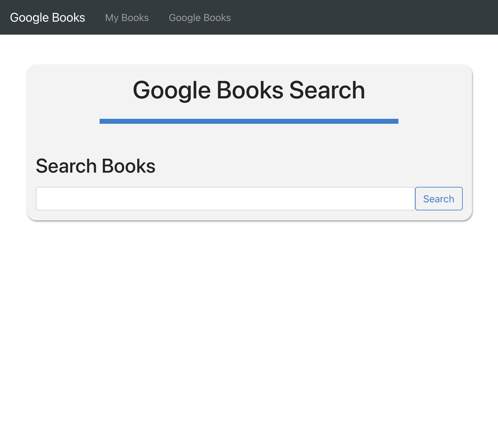
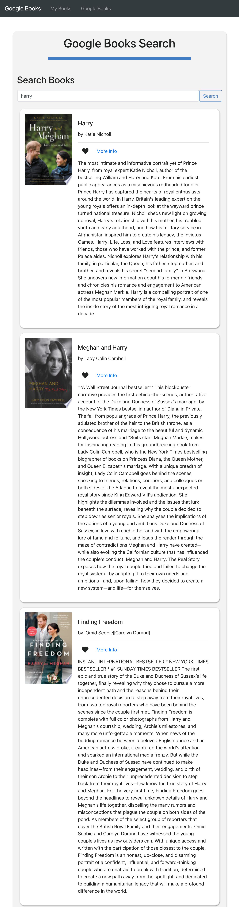
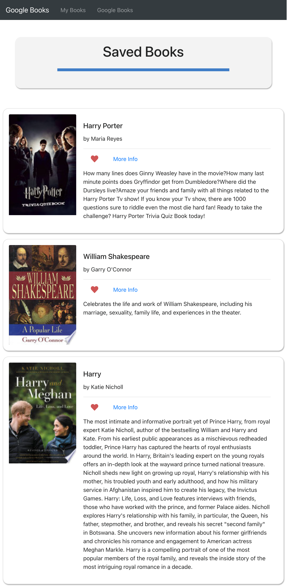

# react-book-search

## Description

The Google book search is a single-page web application built with React. It uses data fetched from the Google Books API. A deployed version of this can be found [here](https://evening-dusk-00163.herokuapp.com/).

## Installation

To be able to run this application locally:

1. Make sure to install [node.js](https://nodejs.dev/) on your local machine.
2. Clone or download the book search repository. Navigate to the root directory of the copy in your CLI and run the following command to install all required dependencies:
```
    npm install
```
3. Lastly, run the following to start a development server on localhost:
```
    npm start
```

## Usage

* When the page loads, you will be presented with a search bar.
* Start typing any book name in the input field to to begin searching the Google Books API.
* You can can favorite and unfavorite books and see your favorites by clickig on the My Books section.

## Demo





